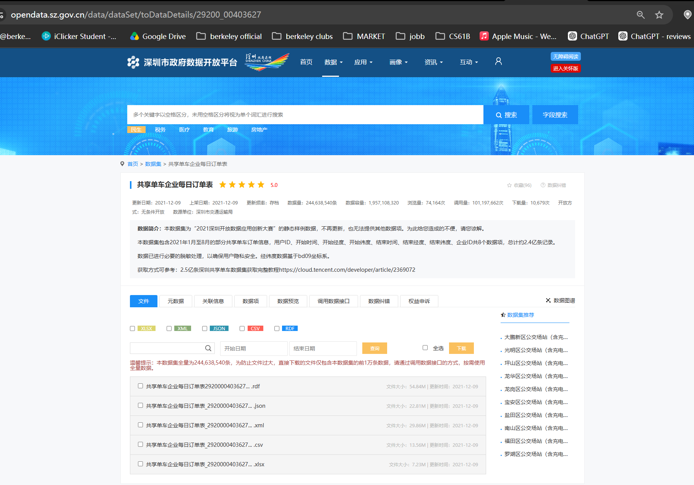
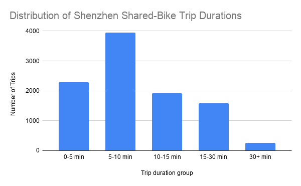
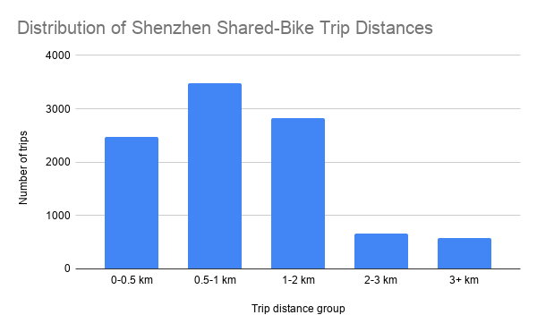

# Short Trips, Big Infrastructure: What Shenzhen Shared-Bike Orders Reveal About the Last Mile

## Introduction

Shared bikes are easy to overlook because each trip is short. But in a dense city like Shenzhen, short trips matter. A shared bike can connect a subway station to an office building, a residential community to a shopping area, or a bus stop to a final destination.

This project looks at shared-bike order data from Shenzhen to understand how shared bikes function in everyday urban mobility. My main question is: **what can Shenzhen shared-bike trip data tell us about the city’s last-mile transportation system?**

The main finding is that most trips in this sample were very short in both time and distance. That suggests shared bikes should not only be understood as private app-based services. In this dataset, they also look like a small but important layer of last-mile transportation infrastructure.

## Dataset

The dataset comes from the **Shenzhen Government Data Open Platform**. I used the dataset called **“Shared Bike Company Daily Order Table”** / **共享单车企业每日订单表**.

Original data source: [Shenzhen Government Data Open Platform](https://opendata.sz.gov.cn/data/dataSet/toDataDetails/29200_00403627)

Note: The Shenzhen Government Data Open Platform may not be accessible from every location, and some users may need a Chinese network connection, VPN, or platform login to view the original page. For verification, I included a screenshot of the original dataset page below.

The CSV file I downloaded contains **10,000 shared-bike trip records**. Each row represents one shared-bike order. The original dataset used Chinese column names, so I translated the main column headers into English before doing the analysis.

The main columns included:

- Company ID
- Start Longitude
- Start Latitude
- Start Time
- User ID
- End Longitude
- End Latitude
- End Time

The dataset is useful because it includes start and end times, as well as start and end coordinates. This made it possible to estimate how long each trip lasted and how far each trip moved from its starting point to its ending point.

However, the dataset also has limits. It only shows a sample of orders from one date, **August 31, 2021**, and the records in this downloaded CSV cover roughly the early morning period. Because of that, this project should not be read as a full picture of all shared-bike use in Shenzhen. It is better understood as a small sample that can still show useful patterns about short-distance bike trips.

## Analysis Process

I used Google Sheets to clean and analyze the dataset.

Google Sheets analysis: [View my analysis spreadsheet](https://docs.google.com/spreadsheets/d/1UQv35W5Dy6dY6Ubz36UaZL6xkFu0qeh2uYrsXbZfjts/edit?usp=sharing)

First, I imported the CSV file into Google Sheets and renamed the spreadsheet **“Shenzhen Shared Bike Orders Analysis.”** Because the original dataset used Chinese column names, I translated the column headers into English. For example, “开始时间” became “Start Time,” “结束时间” became “End Time,” “开始经度” became “Start Longitude,” and “开始纬度” became “Start Latitude.”

Next, I created a new column called **Trip Duration Minutes**. I calculated this by subtracting each trip’s start time from its end time and converting the result into minutes.

Then I created a **Duration Group** column to group each trip into five time ranges:

- 0-5 minutes
- 5-10 minutes
- 10-15 minutes
- 15-30 minutes
- 30+ minutes

After that, I created a new column called **Straight-line Distance KM**. I used the start and end longitude/latitude points to estimate the straight-line distance between where each trip began and ended. This is not the exact route distance, but it gives a basic estimate of how far each trip moved across the city.

Finally, I created a **Distance Group** column to group each trip into five distance ranges:

- 0-0.5 km
- 0.5-1 km
- 1-2 km
- 2-3 km
- 3+ km

I used pivot tables to count how many trips fell into each duration group and distance group. Then I used those pivot tables to create two charts.

## Finding 1: Most shared-bike trips in this sample were short in time

**Chart 1. Distribution of Shenzhen shared-bike trip durations.**  
Source: Shenzhen Government Data Open Platform, Shared Bike Company Daily Order Table. Analysis by author.

The first chart shows that most trips in this sample were short. Out of 10,000 trips, **8,156 trips lasted under 15 minutes**, or about **82%** of the sample.

The largest group was **5-10 minutes**, with **3,945 trips**. The next largest group was **0-5 minutes**, with **2,291 trips**. Only **263 trips** lasted more than 30 minutes.

This matters because it suggests shared bikes in this sample were not mainly used for long rides. Instead, they were mostly used for short movements. That pattern fits the idea of shared bikes as a last-mile tool: something people may use to move between transit stations, homes, offices, shops, or other nearby destinations.

## Finding 2: Most trips were also short in distance

**Chart 2. Distribution of Shenzhen shared-bike trip distances.**  
Source: Shenzhen Government Data Open Platform, Shared Bike Company Daily Order Table. Analysis by author.

The second chart shows that most trips were also short in estimated distance. Out of 10,000 trips, **8,774 trips were under 2 kilometers**, or about **88%** of the sample.

The largest distance group was **0.5-1 km**, with **3,484 trips**. The next largest group was **1-2 km**, with **2,825 trips**. Only **572 trips** were longer than 3 km.

This strengthens the last-mile interpretation. If most trips are less than 2 km, then shared bikes are probably not replacing long-distance transportation. Instead, they appear to fill short gaps in the city’s mobility system. These short trips may be too long to walk comfortably but too short to justify a car, taxi, or subway ride.

## Methods and Limitations

This project used a simple Google Sheets workflow: importing a CSV file, translating column names, creating calculated columns, grouping trips into categories, building pivot tables, and making charts.

There are several limitations.

First, this dataset is only a sample of 10,000 records. It does not represent all shared-bike trips in Shenzhen. The sample is also from one date, so I cannot make claims about seasonal trends, weekday versus weekend patterns, or long-term changes in shared-bike use.

Second, the distance calculation is based on straight-line distance between the start and end coordinates. The real route taken by a rider was probably longer because streets are not straight lines. Because of this, the distance numbers should be treated as estimates, not exact trip distances.

Third, the dataset does not show why each person used a bike. It does not say whether the trip was for commuting, shopping, school, leisure, or connecting to public transit. I can identify short-trip patterns, but I cannot fully explain rider motivation.

Fourth, some records may include GPS errors, unusual trips, or operational activity. For example, a few trips appear much longer than most others. These outliers are still part of the dataset, but they should not drive the main interpretation.

## Ethical Concerns and Additional Reporting

This dataset appears to reduce privacy risk because user IDs are masked with asterisks, so individual riders are not directly identifiable. However, mobility data can still raise ethical concerns. If more detailed user-level or location-level data were released, it could reveal sensitive patterns about where people live, work, study, or travel.

There is also a risk of overinterpreting the data. A short trip does not automatically mean a rider was connecting to a subway station or using the bike for commuting. It only means the trip was short in time or distance. To make this a complete and ethical story, more reporting would be needed.

A fuller version of this story would include interviews with shared-bike users, transportation officials, and shared-bike companies. It would also be useful to compare this dataset with subway station locations, population density, weather data, and different times of day. That would help explain not only how far people ride, but why and where shared bikes matter most.

## Final Takeaway

This Shenzhen shared-bike dataset shows that most trips in the sample were short. About **82%** of trips were under 15 minutes, and about **88%** were under 2 kilometers by estimated straight-line distance.

The main takeaway is that shared bikes should not only be understood as a private app-based service. In this sample, they also function like last-mile infrastructure. They help fill small but important gaps in the urban transportation system, especially for trips that are too short for major transit but still important in everyday city life.
